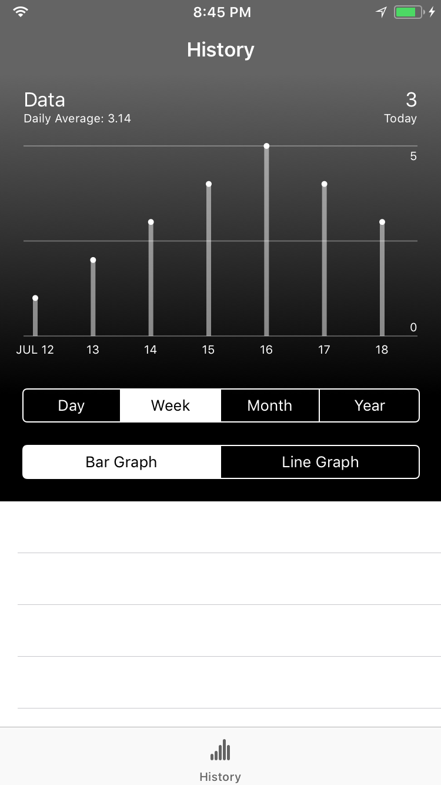
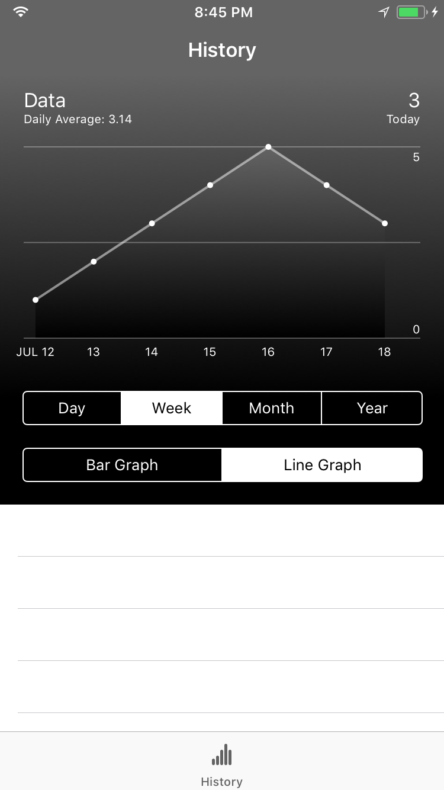

# UIGraphView

UIGraphView is a view type designed for iOS using the Swift programming language.

| Bar Graph Mode | Line Graph Mode |
|:---------------:|:--------------:|
|||

Designed to display a timeline of information:
- Past day by hour
- Past week by day
- Past month by day
- Past year by month

Can be modified to display different types of information sets.

### Features
- Easy installation with a single function to set up
- Customizable design through interface builder
- Automatically creates x-axis labels based on timeFrame passed and current date

## Installation
Simply add `UIGraphView.swift` and `SharedExtensions.swift` to your Xcode project.

Note:
`SharedExtensions.swift` contains an extension I wrote in order to easily return a clean string from a Double. This is used in several places in `UIGraphView.swift` so it is essential. Alternatively, you can copy the `cleanValue` extension and paste it at the end of `UIGraphView.swift`.

## Usage

Add `UIGraphView.swift` to your Xcode project.

Add a view to your view controller and set its class to UIGraphView.

Create an @IBOutlet of type UIGraphView and point it at the view:

```swift
@IBOutlet var graphView: UIGraphView!
```

To setup the graph information use `configure`:

```swift
graphView.configure(graphData: [Double],
                    graphTimeFrame: String,
                    graphTitle: String,
                    graphSubtitle: String,
                    latestEntry: String,
                    latestEntryTime: String)
```

`graphData` expects an array of Doubles and should automatically adjust placement of data points based on the amount of entries in the array.

`graphTimeFrame` expects a string of `Day`, `Week`, `Month`, or `Year`. If one of these strings is passed to `graphTimeFrame`, x-axis labels will be automatically created for you based on that time frame and the current date.

`graphTitle`, `graphSubtitle`, `latestEntry`, and `latestEntryTime` all expect String values.

While the graph should accept any length of `graphData` array, for the data points to properly line up with the x-axis labels you should use an array with a length appropriate for the `graphTimeFrame` you use:
- `Day` expects 24 entries
- `Week` expects 7 entries
- `Month` expects 31 entries
- `Year` expects 12 entries

### Interface Builder Designable
`UIGraphView` can be set up in Interface Builder. You can specify Graph Type (`barGraph`), Graph Corners (`cornerRounding`, `cornerRadius`), Graph Background Colors (`gradientTop`, `gradientBottom`), and Graph Information Colors (`graphLineColor`, `graphDataColor`, `graphFontColor`). All of these have default settings.

## Requirements
UIGraphView was built and tested using:
- iOS 11
- Xcode 9
- Swift 4

## Author

Programmed and designed by Peter Mostoff. [You can contact me via Twitter](https://twitter.com/pmostoff) if you'd like! I'm definitely open to suggestions on how to improve this code. I made it work for what I needed and thought I'd share, but I'm sure there are ways to improve it that I haven't even thought of. Please let me know if you have any suggestions!

If you do use this code in an application you're working, I'd really appreciate you letting me know. I'd really enjoy getting to know this was useful for someone else and maybe I'll even drop in a link to your app here!

If you're interested, you can visit my personal site to see what I'm up to at [Mostoff.me](http://mostoff.me) or if you want to support my work, check out the apps that I've published on the [App Store](https://itunes.apple.com/tc/developer/peter-mostoff/id1080412491)!

### Apps Using UIGraphView
[Gone So Far: Distance Tracker](https://itunes.apple.com/tc/app/gone-so-far-distance-tracker/id1080412492?mt=8)

[Hydration: Water Tracker](https://itunes.apple.com/tc/app/hydration-water-tracker/id1236086101?mt=8)

[HeartRate: BPM Tracker](https://itunes.apple.com/tc/app/heartrate-bpm-tracker/id1236088071?mt=8)

## License
`UIGraphView` is available under the MIT license. See the LICENSE file for more info.
